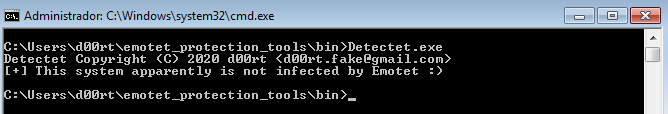
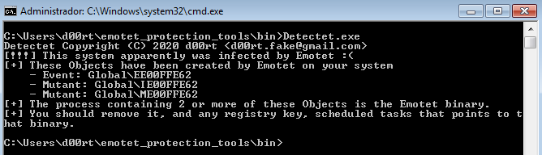
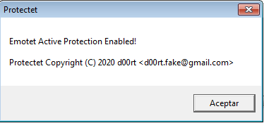
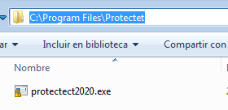
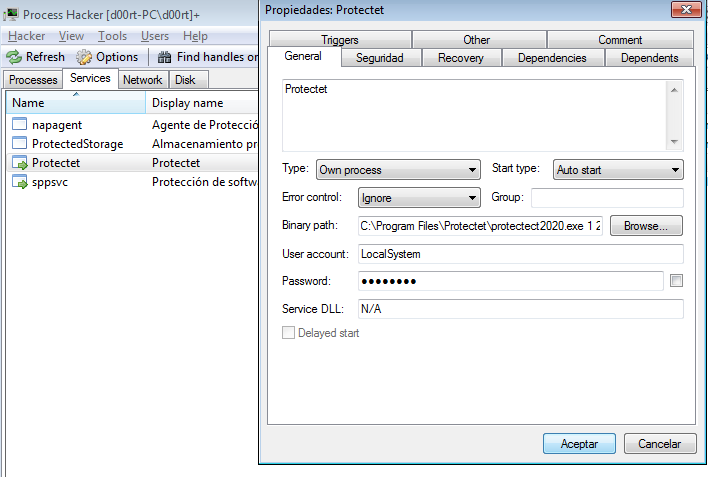
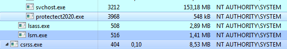

# Emotet Protection Tools
In this repository two tools are provided, Detectet and Protectet. These tools allow you to protect your system and detect if your computer is infected by Emotet. This way you become immune to Emotet malware.

Both, Detectet and Protectet use the `./src/utils.h` file, which provides some common functionalities.

### Compilation
If you are using linux to compile, you must install [mingw32](http://retroshare.sourceforge.net/wiki/index.php/Ubuntu_cross_compilation_for_Windows) on your machine for a successfull compilation.

To compile both tools (on Linux) you only need to do the following command:
```
make
```
You can see the configuration inside `./Makefile` file.

After a successfull compilation the following files are created:
* `./bin/Detectet.exe`
* `./bin/Protectet.exe`

Otherwise you can compile both tools separately using the following combination of files using the compiler you most like:
`.src/detectet.c ./src/utils.h` and `.src/detectet.c ./src/utils.h`

### Detectet
Detectet is a tool that lets you know if your system is infected by Emotet or not. If it is infected, it will tell you which elements are created by Emotet on your system. To remove Emotet from the infected system, it is necessary to see which process has those indicators. 
If you need more help for the complete disinfection of the system do not hesitate to contact me 

mail: <d00rt.fake@gmail.com>
twitter: @D00RT_RM.

##### Usage
You only need to execute it from the command line. (`cmd.exe`, `powershel.exe`, ...)
`emotet_protection_tools\bin>Detectet.exe`

* Clean system



* Infected system



### Protectet
Protectet is a vaccine intended to protect computers from Emotet malware. 
Installing Protectet helps you in 2 ways:
1. If Protectet is installed on a system that has not been infected by Emotet, the system cannot be infected by Emotet payload. 
2. If the system is already infected, installing Protectet prevents the Emotet process from running on the system (it does not remove the Emotet infection, but does not let it run)

##### Usage
You only need to execute `Protectet.exe` (preferably with administrator permissions), and it will be installed in the following default folder `%PROGRAMFILES%\Protectet`. The name of the installed executable is `protectet2020.exe`. A service called `Protectet` is also created, so please make sure this service is created and running.

1. After double-click as administrator



2. Installation directory



3. Created Service



4. Running process




### Disclaimer
It is possible that these tools will stop working in the future because the Emotet malware is in continuous development, I am not responsible for the good or bad performance of the tool. Also this tool has been tested only on `Windows 7 Enterprise (SP1)` and `Windows 10 Pro Version 1607 (Build 14393.0)`.
